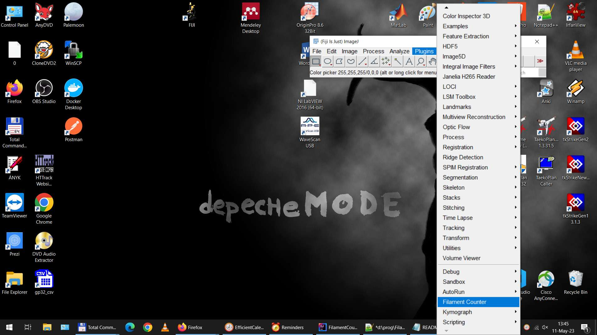
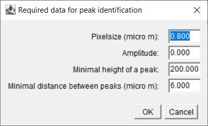
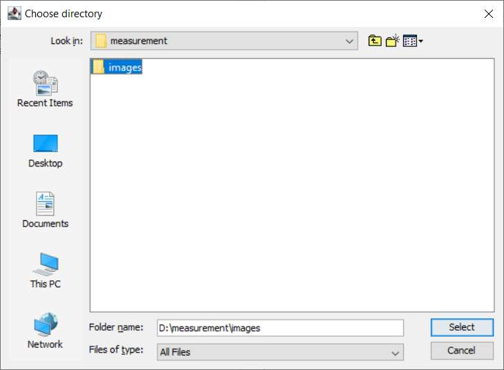
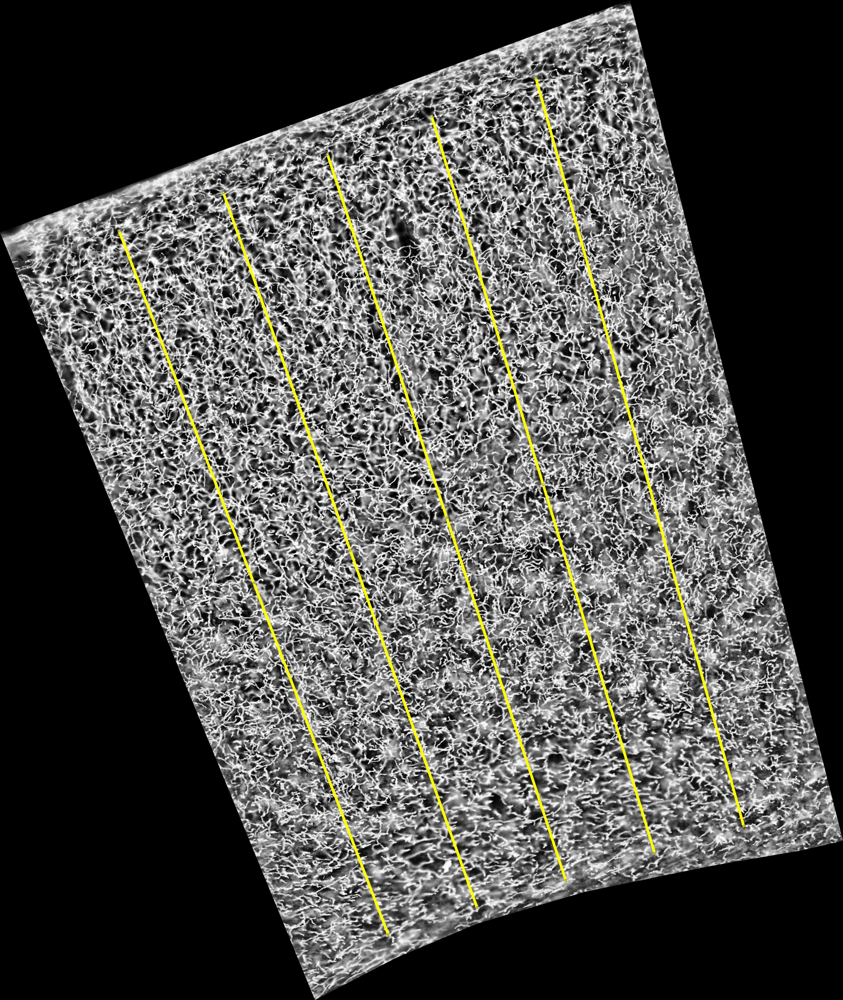
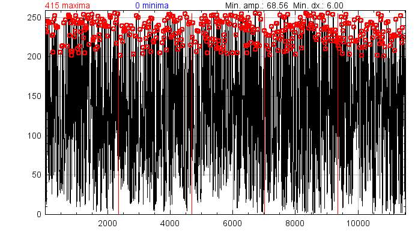

# Filaments Counter

## Purpose
This FIJI Plugin expect input files in an arbitrary folder structure.  
The program will process all the .tif files and create the result.csv files for each folder recursively.  
The input file should contain a ROI (you can find an example in the ExampleData folder).  
  
This plugin:
* Create linear ROIS inside the defined area. 
* It measures the intesity along these lines. 
* It calculate filaments density (1/mico m) by performing [BAR Find Peaks](https://imagej.net/plugins/find-peaks)'s peaks identification algorithm on these plot profiles.

## Install
* Clone the Maven project in this repository to your local drive.
* Build your *.jar files
* Copy the FilamentCounter-\*.\*.jar fil to the plugins folder of FIJI (for example: Program Files/FIJI/plugins)

## Use
* Run FIJI
* Choose the Plugin>Filament Counter option

* Provide the requred data for the peak identification
    * Pixel size in micro m  
	* Amplitude (Based on [BAR Find Peaks documentation](https://imagej.net/plugins/find-peaks) it is the smallest depth (in Y-axis units) that a qualified valley must exceed. By entering 0, it is set to one standard deviation of the data.)
    * Min peak height (The smallest value (in Y-axis units) a qualified peak must exceed.)
    * Minimal distance between peaks (The smallest separation (in micro m) between identified peaks.)  
 
* Select a folder which contains the files need to be analyzed  
 
* The plugin will firstly perform the built in Enhance Local Contrast (CLAHE) algorithm, in order to increase the contrast.
* One of the created output is the saved set of linear ROIs (FileName_roi.zip)
* For a quick overview the linear ROIa are exported as BMP images as well (ROIs_FileName.bmp).

* The plot profiles with the identified peaks for each input images are available too (IntensityProfile_FileName.bmp).

* The main output are the result.csv files for each directory. It contains the output data
    * filename
	* length of ROIs in micro m
	* number of identified peaks
	* filament density i.e. number of identified peaks divided by length of ROIs
	* the date and time of analysis
	* the parameters used by peaks finding

