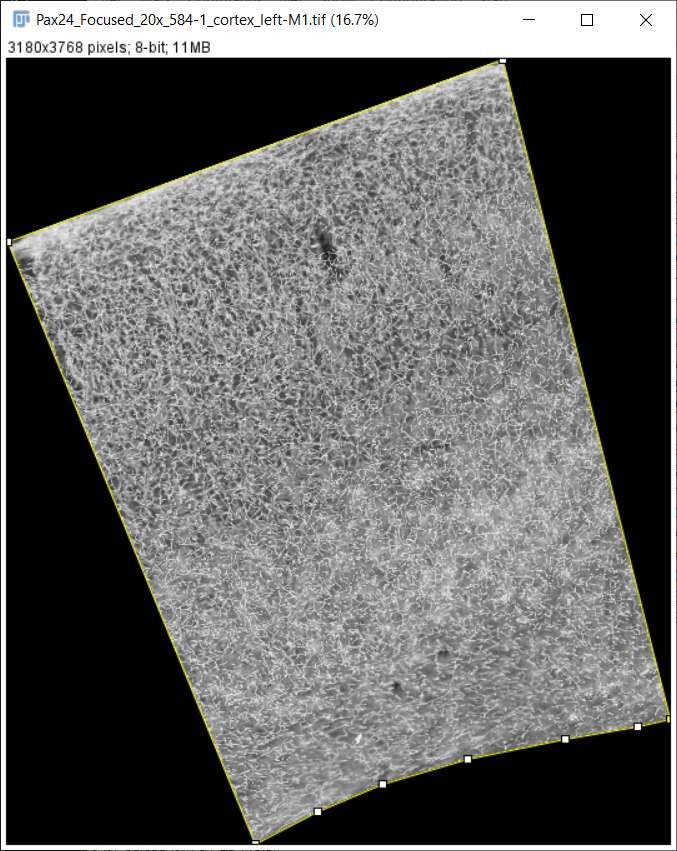

# Filaments Counter

## Purpose
This Fiji Plugin expect input files in an arbitrary folder structure.
The program will process all the .tif files and create the result.csv files for each folder recursively.
The input file should contain a ROI (see the example below).
